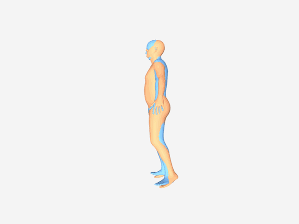
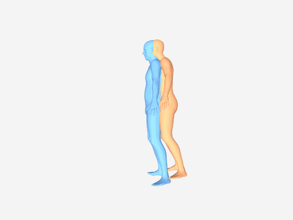
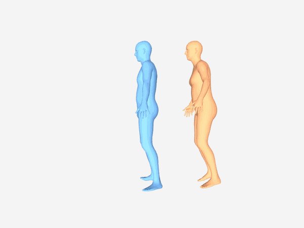

# Multi-View Video Diffusion for Humanoid Mesh Animation

Research code for the project **“Evaluating Multi-View Video Diffusion for Humanoid Mesh Animation”**, exploring how synthesized multi-view videos can improve 3D motion reconstruction for animating humanoid meshes.

<table>
  <tr>
    <td align="center" width="33%">
      <br>
      <strong>Ours</strong><br>
      <sub>SV4D 2.0 + EasyMocap</sub>
    </td>
    <td align="center" width="33%">
      <br>
      <strong>Multi-HMR</strong><br>
      <sub>Single-view baseline</sub>
    </td>
    <td align="center" width="33%">
      <br>
      <strong>WHAM</strong><br>
      <sub>Single-view baseline</sub>
    </td>
  </tr>
</table>

This project explores video diffusion as an indirect motion representation for 3D mesh animation. 
Rather than generating motion directly in 3D, human motion is represented through video and subsequently 
reconstructed as an explicit 3D mesh sequence.

Recovering 3D motion from monocular video is inherently ambiguous due to missing depth information and self-occlusions. 
We investigate whether a pretrained multi-view video diffusion model can synthesize additional synchronized viewpoints 
that provide stronger geometric constraints for recovering the underlying human motion.

Using **SV4D 2.0** for synchronized novel-view synthesis together with an **EasyMocap**-based SMPL reconstruction pipeline, 
the proposed multi-view approach reduces MPVPE by **30.3%** compared with **Multi-HMR** and **48.0%** 
compared with **WHAM** on the controlled CAPE evaluation.

📄 [Full Project Report](docs/ProjectReport.pdf)

## Approach

<p align="center">
  
</p>

The proposed pipeline uses video diffusion as an intermediate representation for transferring semantically described human motion onto a static humanoid mesh.

A single-view video diffusion model first generates a video-based motion prior from a rendering of the input mesh. 
Rather than reconstructing the animation directly from this monocular sequence, 
a multi-view video diffusion model synthesizes synchronized observations from additional viewpoints. 
These views are then jointly processed by a human-specific multi-view reconstruction pipeline 
to recover the final 3D mesh animation.

For the controlled experimental evaluation, the initial single-view generation stage is 
replaced by rendered motion sequences with known 3D ground truth from CAPE. 
This isolates the multi-view synthesis and reconstruction stages and enables quantitative evaluation 
of the effect of synthesized target views.

## Key Results

The core experiment compares the synthesized multi-view reconstruction pipeline against the single-view human 
reconstruction methods **WHAM** and **Multi-HMR**.

| Method | MPVPE ↓ [mm] | PA-MPVPE ↓ [mm] | Pelvis-Aligned MPJPE ↓ [mm] | PA-MPJPE ↓ [mm] | Acceleration Error ↓ [mm/frame²] |
|---|---:|---:|---:|---:|---:|
| WHAM | 112.57 | 47.41 | 66.03 | 38.25 | 11.98 |
| Multi-HMR | 83.98 | **41.06** | 64.11 | **32.83** | 17.08 |
| **SV4D 2.0 + EasyMocap (Ours)** | **58.55** | 44.72 | **49.55** | 36.37 | **10.48** |

The synthesized multi-view observations substantially improve reconstruction metrics
that retain information about global human motion. Multi-HMR remains stronger on
the Procrustes-aligned metrics, which focus more strongly on local pose accuracy after
removing global translation, rotation, and scale.

## Contributions
- Proposed a multi-view video diffusion framework for humanoid mesh animation, using synthesized target views to provide additional geometric constraints for 3D human motion reconstruction.
- Implemented the corresponding multi-view reconstruction and evaluation pipeline, integrating SV4D 2.0 with EasyMocap-based SMPL reconstruction.
- Built a benchmarking framework for evaluating EasyMocap, WHAM, and Multi-HMR against CAPE ground-truth mesh sequences using multiple 3D reconstruction and temporal metrics.
- Designed and conducted experiments on viewpoint spacing, number of synthesized views and target-view conditioning to study their effect on both view synthesis quality and downstream 3D reconstruction.
- Investigated long-horizon multi-view video generation and developed a mesh-level reconditioning strategy for reducing error accumulation across generation windows.

## Research Questions

<details> <summary><strong>RQ1 — Do synthesized target views improve 3D human motion reconstruction?</strong></summary>

Synthesized target views provide useful additional geometric constraints for recovering 3D human motion. The proposed pipeline achieves 58.55 mm MPVPE, compared with 83.98 mm for Multi-HMR and 112.57 mm for WHAM, with the main benefit appearing in reconstruction metrics that retain information about global motion.

</details>

<details> <summary><strong>RQ2a — How does angular viewpoint spacing affect reconstruction?</strong></summary>

Increasing the angular spacing introduces a trade-off between geometric coverage and synthesis quality. 
Wider viewpoints provide stronger geometric constraints when synthesis errors are removed using source-rendered views, but synthesized-view fidelity decreases at larger angular offsets.
Consequently, the 30° and 45° configurations outperform the 72° configuration in downstream reconstruction, with MPVPE increasing from 58.55 mm at 30° to 68.65 mm at 72°.

</details>

<details> <summary><strong>RQ2b — How does the number of views affect reconstruction?</strong></summary>

Additional views can improve reconstruction by providing complementary observations, 
but the improvement is not monotonic because each synthesized view can also introduce noise or cross-view inconsistencies.
The full five-view configuration achieves the best overall performance with 58.55 mm MPVPE, although the improvement over smaller view subsets remains comparatively small.

</details>

<details> <summary><strong>RQ3 — Does target-view conditioning improve multi-view synthesis?</strong></summary>

Providing source-rendered conditioning images from the target viewpoints substantially improves both synthesized-view fidelity and temporal stability.
LPIPS decreases from 0.1078 to 0.0524, while downstream reconstruction improves from 66.68 mm to 58.55 mm MPVPE. 
The substantially larger improvement in image fidelity than in reconstruction accuracy indicates that visual similarity alone does not fully capture geometric consistency.

</details>

<details> <summary><strong>RQ4 — Can reconditioning improve long-horizon generation?</strong></summary>

To reduce error accumulation across consecutive generation windows, we introduce a mesh-level reconditioning strategy that reconstructs intermediate 3D motion and re-renders it from the target viewpoints before continuing generation.
Compared with the native autoregressive continuation of SV4D 2.0, mesh-level reconditioning better preserves synthesized-view fidelity over longer horizons, reaching 0.0920 vs. 0.1014 LPIPS after the second reconditioning boundary.
However, this improvement does not translate into better downstream reconstruction: native SV4D 2.0 continuation achieves 66.34 mm MPVPE, compared with 69.65 mm for mesh-level reconditioning. Reliable long-horizon continuation therefore remains an open challenge.

</details>

## Repository Structure

```text
.
├── benchmark/              # 3D reconstruction evaluation, metrics, trackers, and configs
├── video_evaluation/       # Evaluation of synthesized target-view video quality
├── sv4d_scripts/           # Modified SV4D 2.0 scripts kept for documentation
├── scripts/                # Standalone research utilities for rendering, preprocessing, conversion and analysis
├── environments/           # Conda environment definitions
├── data/                   # Dataset and rendering data
├── outputs/                # Generated experiment outputs
├── visualization/          # Visualization outputs
├── run_benchmark.py        # Entry point for reconstruction benchmarks
└── run_video_evaluation.py # Entry point for synthesized-video evaluation
```

## Environments

Different stages of the pipeline use separate Conda environments:

```text
environments/
├── rendering.yml
├── benchmark.yml
└── video_evaluation.yml
```

For example:

```bash
conda env create -f environments/benchmark.yml
```

## Documentation

More detailed instructions are kept with the corresponding part of the repository.

- [`benchmark/README.md`](benchmark/README.md) — reconstruction benchmark
- [`video_evaluation/README.md`](video_evaluation/README.md) — synthesized-video evaluation
- [`scripts/README.md`](scripts/README.md) — standalone utility scripts used during the experimental workflow
- `sv4d_scripts/` — modified SV4D 2.0 scripts kept for documentation; they are not intended to be run from this repository

## Benchmark

Reconstruction benchmarks are run through:

```bash
python run_benchmark.py <config>
```

See [`benchmark/README.md`](benchmark/README.md) for available configurations and required environment variables.

## Video Evaluation

Synthesized target-view videos are evaluated through:

```bash
python run_video_evaluation.py <config>
```

See [`video_evaluation/README.md`](video_evaluation/README.md) for available configurations and required environment variables.